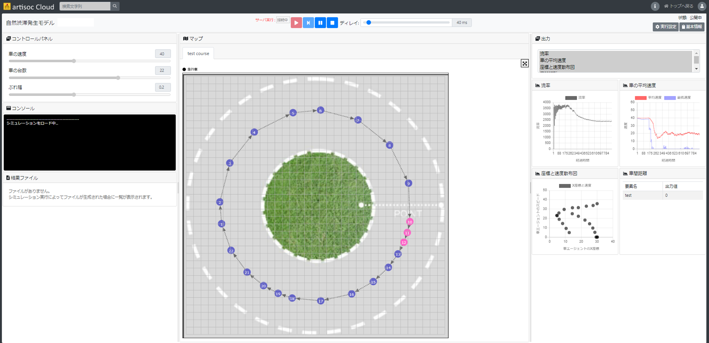
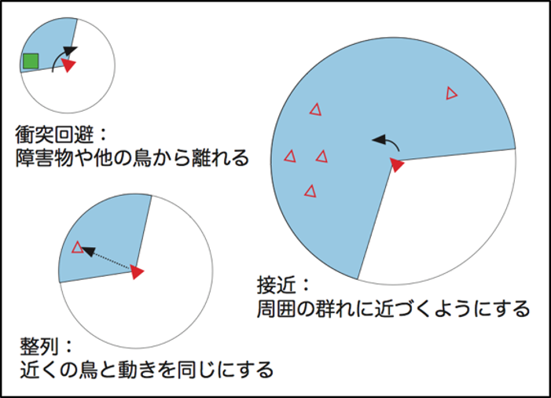

# 参考：artisoc Cloudについて
artisoc Cloudは、MAS（マルチエージェント・シミュレーション）をWebブラウザ上で手軽に実行・共有できるほか、クラウド上での大量同時実行などの機能を使った高い拡張性を有するソフトウェアです。

## MAS（マルチエージェント・シミュレーション）
- 個々のエージェントが独自のルールを持って行動し、相互作用した結果を分析する、複雑系をコンピュータ上で分析するシミュレーションです。
    - エージェント：自分の周囲の状況を認識し、それに基づいて、一定のルールのもとで自律的に行動する主体のことです。現実社会では、人間や生物がエージェントに該当します。
    - 複雑系：複雑系は、多数の相互作用する要素（エージェント、プロセス等）によって構成され、全体の挙動が個々の挙動の単純な足し合わせでは導出できないものです。例えば、鳥の群れや、高速道路での自然渋滞などが該当します。

## artisoc Cloudに関する参考資料
- [artisoc Cloudの概要](https://mas.kke.co.jp/artisoccloud/)
    - artisoc Cloudの特徴、ライセンス等を整理したページです。
- [artisoc Cloud初級チュートリアル](https://mas.kke.co.jp/howto/artisoc-cloud-%e5%88%9d%e7%b4%9a%e3%83%81%e3%83%a5%e3%83%bc%e3%83%88%e3%83%aa%e3%82%a2%e3%83%ab/)
    - artisoc Cloudの使い方を、パワーポイントや動画を使ったチュートリアルとしてまとめています。
- [artisoc Cloudドキュメント：チュートリアル](https://artisoc-cloud.kke.co.jp/documents/tutorial/index.html#gsc.tab=0)
    - artisoc Cloudの実践的なチュートリアルをまとめたドキュメントです。
- [artisoc Cloudドキュメント：マニュアル](https://artisoc-cloud.kke.co.jp/documents/manual/index.html#gsc.tab=0)
    - artisoc Cloudを実際に使う際に参照するマニュアルです。
- [artisoc Cloud](https://artisoc-cloud.kke.co.jp/)
    - artisoc Cloudのトップページです。
