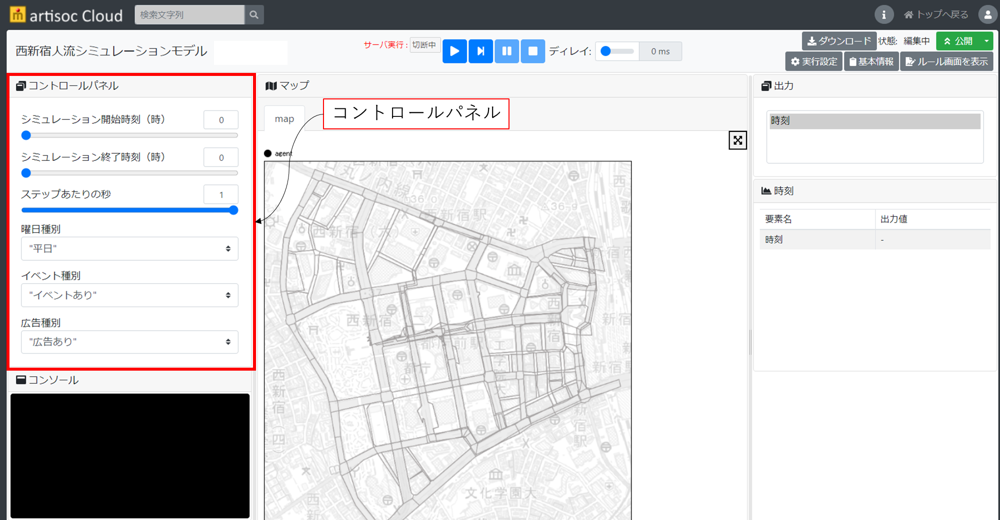

# 使い方
ここでは、歩行シミュレーションモデルの使い方を記載します。

## 実行準備
1. artisoc Cloudにモデルをインポート後、画面左上コントロールパネルから、シミュレーションの実行条件を設定します。具体的には、下記の項目を指定します。

- シミュレーション開始時刻（整数値）
- シミュレーション終了時刻（実数値）
	- 例えば、「8.1」を指定した場合、8時6分まで、「8.2」を指定した場合、8時12分までの実行となります。
- 1ステップあたりの秒数
	- 0.5秒/ステップ：シミュレーション内のエージェントがシミュレーション内の時間で0.5秒に1回計算、判断を行います。
	- 1秒/ステップ：シミュレーション内のエージェントがシミュレーション内の時間で1秒に1回計算、判断を行います。
	- 1ステップあたりの秒数を細かくするとエージェントの行動を細かく表現できますが、シミュレーション内の計算負荷が高くなるため、シミュレーションの実行時間が長くなります。
- イベント有無
	- イベントあり
	- イベントなし
- 曜日
	- 平日
	- 土日祝日
- 広告有無
	- 広告あり
	- 広告なし

## 実行
1. シミュレーション実行条件を設定後、シミュレーション実行ボタンを押し、シミュレーションを実行します。

2. シミュレーション実行完了後、エージェントの行動ログ（csvファイル）が取得できます。

## ルールの編集
1. エージェントの行動ルールを変更したい場合は、トップ画面で「ルール画面の表示」を行い、ルール編集画面に移ります。

2. ルール編集画面に移るとpythonエディタが表示されるので、ルールを変更することが可能です。詳細は、artisoc Cloudマニュアル
(https://artisoc-cloud.kke.co.jp/documents/manual/index.html)
をご参照ください。
