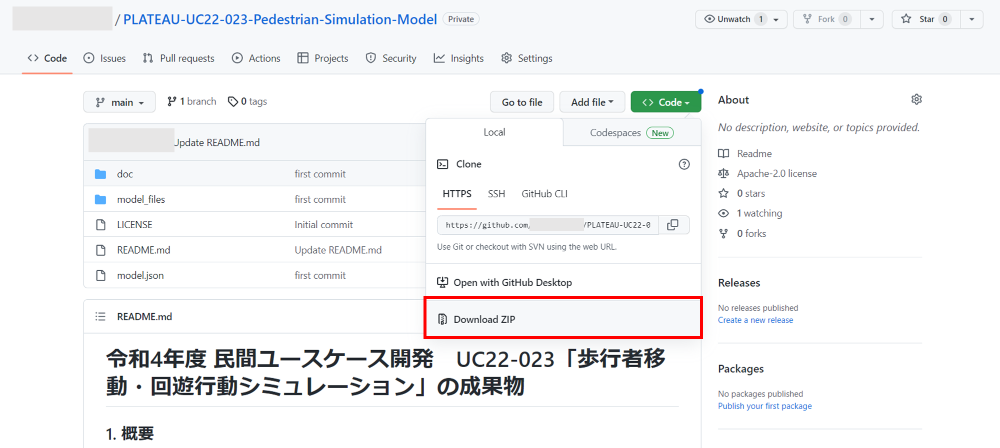
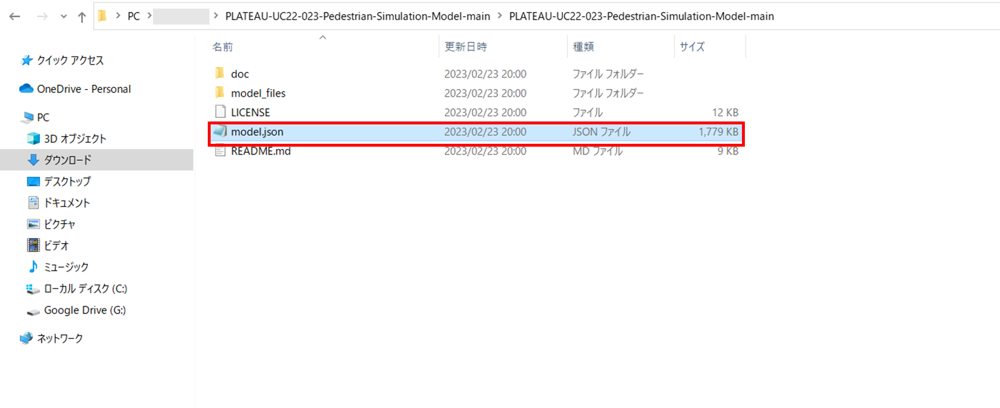
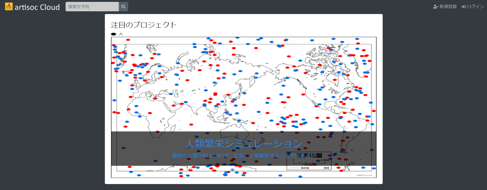
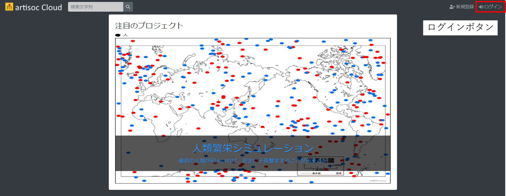
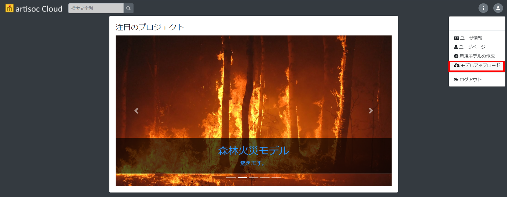
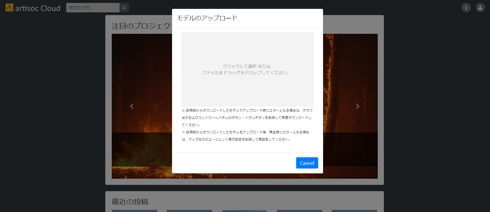

# インストール方法
ここでは、歩行シミュレーションのソースコード編集のためのファイルインストール方法を記載します。

## インストール手順
1. 本リポジトリ内のあるファイル一式を「Code」> 「Download Zip」からダウンロードします。

2. ダウンロードされた「PLATEAU-UC22-023-Pedestrian-Simulation-Model.zip」ファイルを解凍し、「model.json」ファイルを取得します。
 

3. [artisoc Cloud](https://artisoc-cloud.kke.co.jp/)にアクセスします。

4. 右上の「ログイン」ボタンから、ログインを行います。

5. ログイン後、右上のボタンから「モデルをアップロード」を選択します。その後、モデルをアップロードできる画面に移るので、ドラッグアンドドロップにより、取得した「model.json」ファイルをアップロードします。これにより、インストール完了となります。

