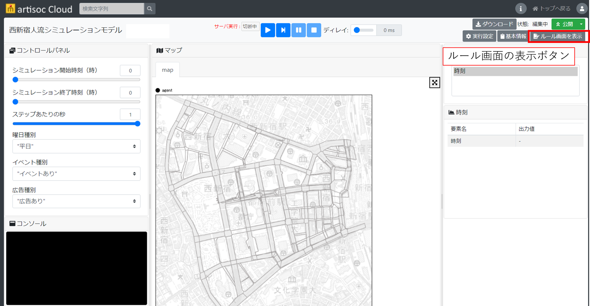
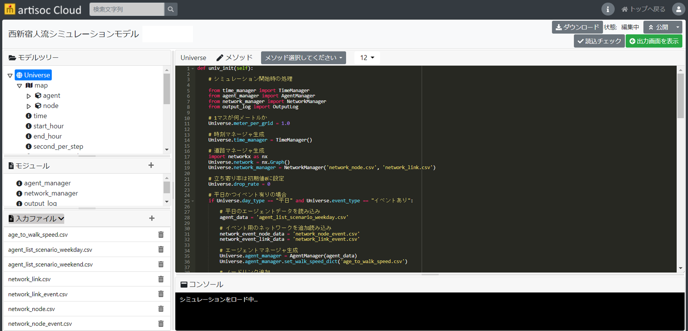

# 歩行者の行動ルールの変更
ここでは、歩行者の行動ルールを変更したい場合の方法を記載します。

現在の歩行シミュレーションモデルにおける行動ルールは、国土交通省民間ユースケース開発UC22-023「歩行者移動・回遊行動シミュレーション」技術検証レポートを参照してください。

## 行動ルールの変更手順
1. エージェントの行動ルールを変更したい場合は、トップ画面で「ルール画面の表示」を行い、ルール編集画面に移ります。

2. ルール編集画面に移るとpythonエディタが表示されるので、ルールを変更することが可能です。詳細は、artisoc Cloudマニュアル
(https://artisoc-cloud.kke.co.jp/documents/manual/index.html)
をご参照ください。
