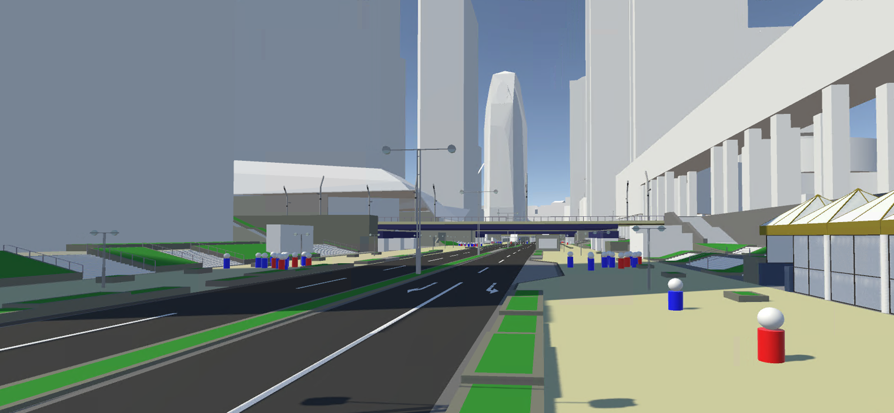

# UC22-023「歩行者移動・回遊行動シミュレーション」　歩行シミュレーションソースコード
本マニュアルは、国土交通省民間ユースケース開発UC22-023「歩行者移動・回遊行動シミュレーション」における、歩行シミュレーションのソースコードの利用方法及び説明となります。

1. [動作環境、前提ソフトウェア](./articles/Environments.md)
2. [必要ライセンス](./articles/NecessaryLicenses.md)
2. [インストール方法](./articles/Installation.md)
3. [使い方](./articles/HowToUse.md)

